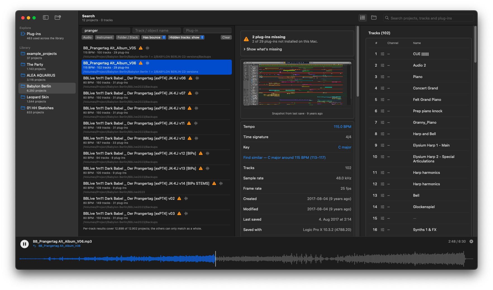

<p align="center"></p>

# LPX Explorer

**Find anything in your Logic Pro projects — without opening Logic.**

LPX Explorer is a fast, native macOS app that reads your `.logicx` projects and lets you search across thousands of them at
once: by project name, track and channel names, and plug-ins. Click a result and you land on that project, scrolled to that
track. It also finds each project's bounces and plays them right in the app.



## Why

Years of projects pile up: "new idea 2", "mix v07", backups of backups. Opening each one in Logic to remember what's inside takes
forever, and Logic can't answer "where else did I use that patch?". LPX Explorer reads the project files directly, so the answer
is instant — and Logic never has to start.

## What it does

- **Library-wide search.** One box searches everything — project, track, object and channel names, and plug-ins. Three fields
  next to it narrow by *project name*, *track / object name* or *plug-in*; buttons limit the result to audio or instrument
  tracks, projects with or without a bounce, and show or skip hidden tracks. Results are projects with the matching tracks
  listed inside them.
- **The tracks as Logic shows them.** Track numbers, hidden tracks, folders and each track's own name, plus the channel and the
  object it belongs to — in a pane of their own that you can hide.
- **Bounces and a player.** The mix and its stems are found next to the project, in a `Bounces` folder (also for projects in
  `Backups`), by name. Play them in the bar at the bottom: waveform, click-to-jump, space bar to play/pause, and a way back to
  the project it came from.
- **Plug-ins and compatibility.** See every plug-in in the library and which projects use it, and which projects need plug-ins
  that aren't installed on this Mac.
- **Project details.** Tempo, key, time signature, sample rate, frame rate, dates, size, the Logic version that saved it, its
  window screenshot and its alternatives. Click a key or tempo to find similar projects.
- **Built for big libraries.** A scan reads each project once (in parallel); after that only new or changed projects are read
  again, so starting up stays quick with thousands of projects.
- **Old projects.** Projects saved by Logic Pro X 10.5 and earlier are read. Single-file Logic 4–9 projects (`.lso`) are listed
  by name, with their bounces.

## Read-only and local

Your projects are irreplaceable, so LPX Explorer is built never to change them:

- It only ever **reads** project files — never writes inside a project, never opens Logic. A test checks a project's checksum
  and timestamps before and after parsing.
- It makes **no network requests**: no updater, no analytics, no web search. A test scans the source for network APIs. (The
  About window has links that open in your browser; the app itself requests nothing.)
- What it remembers (a small cache of what it found) lives in `~/Library/Application Support/LpxExplorer`.

> **Use at your own risk.** The `.logicx` format is undocumented and Apple may change it at any time. Reading is safe by design,
> but keep backups of your work, as always.

## Install

Download the latest `LPX-Explorer-vX.Y.Z.zip` from the
[Releases](https://github.com/goodloops-mirror/LPX-Explorer-Swift/releases) page, unzip it and drag **LPX Explorer** into
Applications. Requires macOS 14 (Sonoma) or later.

Builds that are not signed with a Developer ID are blocked by macOS on first launch: right-click the app ▸ Open, or run
`xattr -dr com.apple.quarantine "LPX Explorer.app"`.

## Using it

1. **Add a folder** with your projects (`⌘O`, or drop it on the window). The first scan takes a while on a big library; the
   progress shows at the bottom.
2. **Search** in the box at the top right, or use the fields above the project list.
3. Click a project for its details and tracks, a track to jump to it, a bounce to play it.

A short guide ships inside the app: **Help ▸ LPX Explorer Manual** (also in [`docs/`](docs/LPX%20Explorer%20Manual.pdf)).

## Build from source

```bash
git clone https://github.com/goodloops-mirror/LPX-Explorer-Swift
cd LPX-Explorer-Swift
swift test                     # the test suite
./scripts/make-app.sh          # builds "build/LPX Explorer.app"
swift run LpxExplorer          # or run it unbundled
```

Needs macOS 14+ and Xcode 16 (Swift 6 toolchain); there are no third-party dependencies. [`CLAUDE.md`](CLAUDE.md) describes the
architecture and the rules this project follows (read-only, local-only, test-first), [`TASKS.md`](TASKS.md) the open work and
the reverse-engineering notes, and [`docs/SIGNING.md`](docs/SIGNING.md) how releases are signed and notarized. Releases are git
tags; [`CHANGELOG.md`](CHANGELOG.md) lists what changed.

## Plug-in support

Plug-in names and install status come from the Audio Units installed on your Mac (`auval -l`). Other plug-in formats aren't
looked at.

## Licence and credits

LPX Explorer is free software, **GPL-3.0-or-later** (see [`LICENSE`](LICENSE)): you may use, change and share it; distributed
derivatives must stay GPL and come with their source.

It is a native rewrite of the original **LPX Explorer by [Rhyd Lewis](https://github.com/rhydlewis)** (GPL-3.0-or-later), whose
reverse-engineering of the `.logicx` format this app builds on — the original is kept in [`legacy-tauri/`](legacy-tauri/) with
its own licence. Thank you.

Published by [**Good Loops**](https://www.good-loops.com).

## Support

If LPX Explorer saves you time, a coffee is very welcome: [☕ Buy me a coffee](https://buymeacoffee.com/hanshafner)
